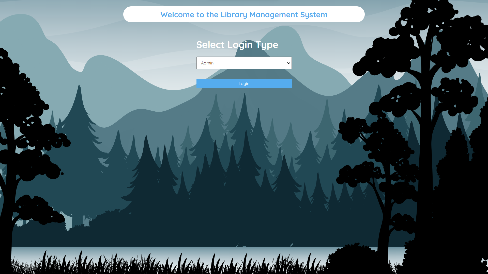
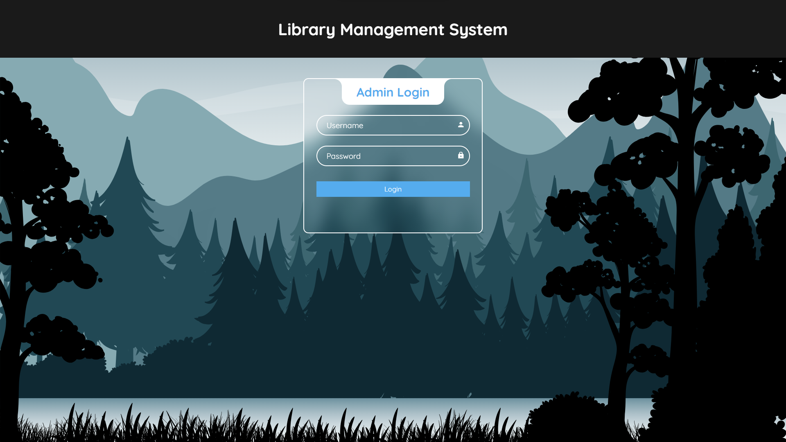
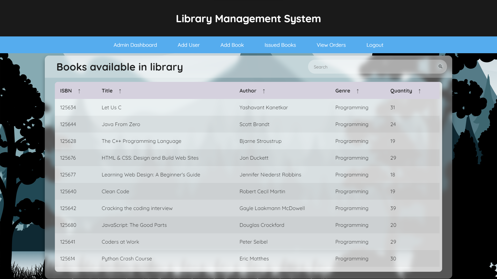
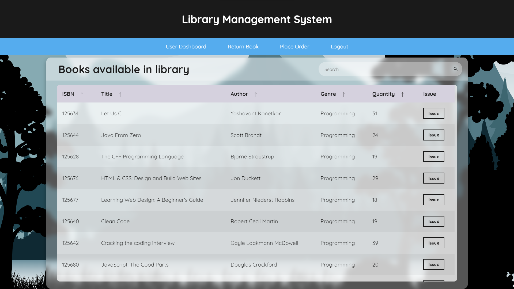
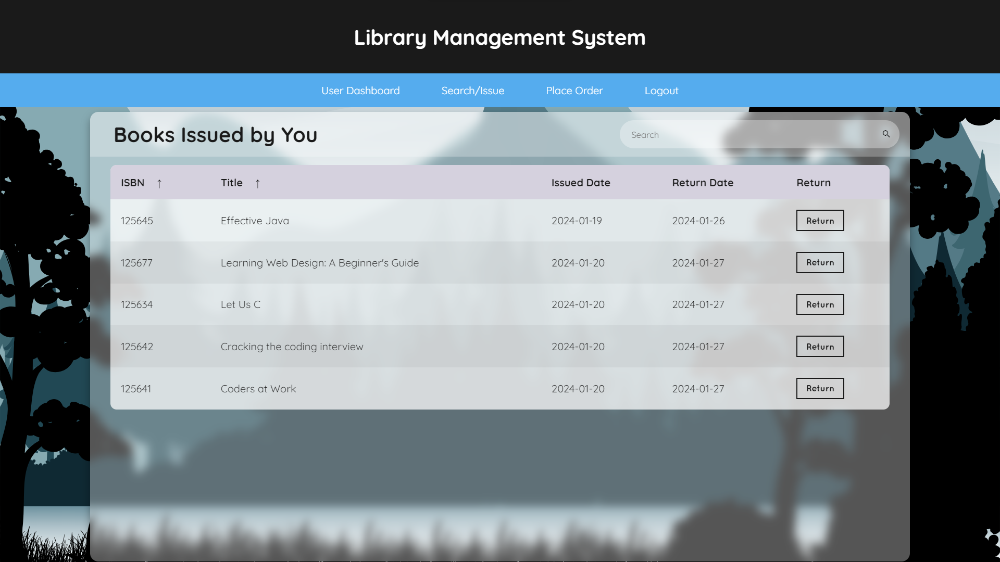

# Library Management System
Library management system is a project which aims in developing a computerized system to maintain all the daily work of library. It has separate interfaces for **ADMIN** and **USER** for effective use of the system. 
The system comprises three main components: the Frontend, Backend, and Database. The Frontend is developed using HTML, CSS, and JavaScript, providing an interactive and user-friendly interface. The Backend is implemented in Flask and for Database MySQL is used.
## SETUP
### Prerequisites

Your system needs to have these technologies. Add their path to the system environment as well.

- [Python](https://www.python.org/downloads/)
- [MySQL Database](https://www.mysql.com/downloads/)
> **NOTE** Set username and password for MySQL as root.

Check the version of these.

    python --version
 

    mysql --version

> If it gives an error. Check whether you have added these to PATH of your system environment or not.

### Installing

Open command prompt in the venv folder and type the following command.

    Scripts\activate
> this will activate the virtual environment.

Now for installing the required tools, copy the following command.

    pip install -r requirements.txt

### Creating the Database
Follow the instructions mentioned in [create DB](venv/createDB.txt) file.

### Deployment
Open the command prompt in venv folder and activate virtual environment.
Now type the following command.

    python app.py

> It will start the local server on which the app will be running. Open the server and all set.

## Screenshots
### INDEX

### ADMIN LOGIN

### USER LOGIN

### VIEW BOOKS

### ISSUE BOOKS

### RETURN BOOKS

> **NOTE** You need to enter the details of books through add books section in admin interface.
